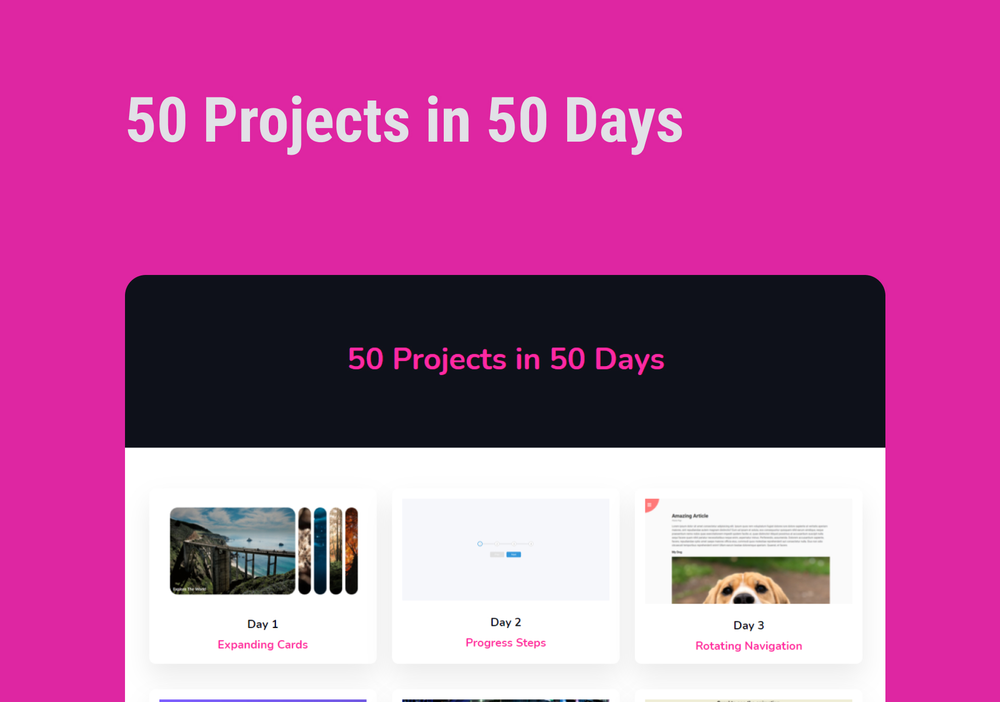
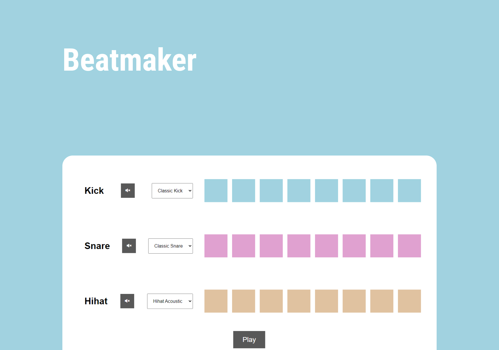

<h1 align="center">Projetos JavaScript</h1> 

  <table border="0" cellspacing="0" cellpadding="0">
    <thead>
      <tr>
        <th>
          <strong><a href="https://github.com/joaom00/moveit">Repositório</a></strong>
          &nbsp;&nbsp;|&nbsp;&nbsp;
          <strong><a href="https://joaom00.github.io/moveit">Site</a></strong>
        </th>
        <th>
          <strong><a href="https://github.com/joaom00/js-funciona-reativo">Repositório</a></strong>
        </th>
      </tr>
    </thead>
    <tbody>
      <tr>
        <td>
            
        </td>
        <td>
            
        </td>
      </tr>
    </tbody>
  </table>

  <table border="0" cellspacing="0" cellpadding="0">
    <thead>
      <tr>
        <th>
          <strong><a href="https://github.com/joaom00/50Projects50Days">Repositório</a></strong>
          &nbsp;&nbsp;|&nbsp;&nbsp;
          <strong><a href="https://joaom00.github.io/50Projects50Days">Site</a></strong>
        </th>
        <th>
          <strong><a href="https://github.com/joaom00/rocker-paper-scissors">Repositório</a></strong>
          &nbsp;&nbsp;|&nbsp;&nbsp;
          <strong><a href="https://joaom00.github.io/rocker-paper-scissors/game.html">Site</a></strong>
        </th>
      </tr>
    </thead>
    <tbody>
      <tr>
        <td>
            
        </td>
        <td>
            
        </td>
      </tr>
    </tbody>
  </table>

  <table border="0" cellspacing="0" cellpadding="0">
    <thead>
      <tr>
        <th>
          <strong><a href="https://github.com/joaom00/beatmaker">Repositório</a></strong>
          &nbsp;&nbsp;|&nbsp;&nbsp;
          <strong><a href="https://joaom00.github.io/beatmaker">Site</a></strong>
        </th>
      </tr>
    </thead>
    <tbody>
      <tr>
        <td>
            
        </td>
      </tr>
    </tbody>
  </table>

